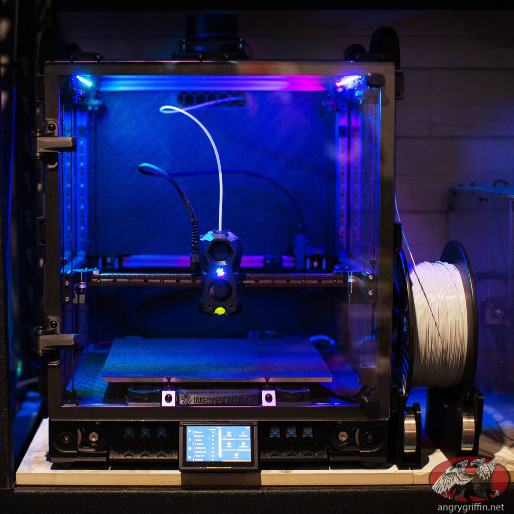

Hithin Pulamarasestty

I am Hithin Pulamarasetty, and I am passionate about the vast capabilities of STEM and additive manufacturing. My interest lies in exploring how cutting-edge technology and engineering can revolutionize industries, from aerospace to robotics, and transform the way we design, create, and innovate. Through my journey in STEM, I am continually driven by the potential to push boundaries and develop solutions that shape the future of manufacturing and beyond.

<h2>Comments</h2>

# 2 minute speech about my experience for sprint 2
Hello everyone! Today, I want to share my insights on while loops in programming, how teaching this concept has enhanced my understanding, and the valuable lessons I’ve learned along the way.

Blog
As I reflect on my experiences, I realize that being organized is crucial in preparing for our project-based learning and assessments. I’ve documented my accomplishments and learning milestones related to while loops in a blog. This blog not only showcases my journey but also demonstrates my readiness for both the challenge-based assessments and project-based learning activities we’re engaging in. It highlights how I’ve embraced the Big Ideas behind programming concepts and how I plan to apply them in real-world scenarios.

Memory
One key highlight from my journey is teaching the concept of while loops to my peers. I explained how while loops execute a block of code as long as a condition is true. This process not only reinforced my understanding but also served as a memorable takeaway for my classmates. When they think of while loops, I want them to recall our engaging discussions and the examples we explored together.

Relevancy
Through teaching and collaboration, I’ve learned the significance of control structures in programming. One impactful lesson was realizing how while loops can be used in various scenarios, from processing user input to automating repetitive tasks. This understanding was reinforced when we examined a lesson on algorithms and control flow, which emphasized the importance of logical thinking in programming. Using a relevancy checklist, I can confidently connect this knowledge to broader programming principles, helping me understand how these concepts intertwine.

Beyond Perfunctory
Finally, I want to emphasize how this experience has led to my personal growth. Initially, I was apprehensive about teaching others, but through this process, I’ve gained confidence in my ability to explain complex ideas clearly and effectively. This Sprint on Big Ideas has allowed me to take ownership of my learning and share my knowledge in a meaningful way. It’s been a journey of self-discovery, and I’m excited to continue exploring and sharing my passion for programming.

Thank you for listening! I hope you find this perspective on while loops and the power of teaching as enlightening as I have.

<!-- Main Button Navigation Section -->
<a href="{{ site.baseurl }}/notebook/"><button>Python Notebook</button></a>

<!-- Button Table at the Top -->
<table>
  <tr>
    <td>
      <!-- Button to navigate to 3D printing explanation -->
      <a href="{{ site.baseurl }}/printing/"><button>Learn About 3D Printing</button></a>
    </td>
    <td>
      <!-- Button to navigate to CSP Struggles -->
      <a href="{{ site.baseurl }}/csp-struggles/"><button>CSP Struggles</button></a>
    </td>
    <td>
      <!-- Button to navigate to Boy Scouts -->
      <a href="{{ site.baseurl }}/boy-scouts/"><button>Boy Scouts</button></a>
    </td>
  </tr>
</table>

<!-- Main Content -->

 Hithin P's Website!

&#128511;

Welcome to my personal website where I share my journey in STEM, Boy Scouts, and much more!

Hithin P is involved in various STEM activities, mentoring young students and leading scouting initiatives...

<!-- Bottom Buttons Section -->

Explore More:

Click here to learn about advice from college students

<a href="{{ site.baseurl }}//College-Talk/"><button>College Talk</button></a>

Click here to learn about Science Olympiad

<a href="{{ site.baseurl }}/science-olympiad/"><button>Science Olympiad</button></a>

Click here to learn about DNHS Campus

<a href="{{ site.baseurl }}/DNHS-Campus/"><button>DNHS Campus</button></a>

Click here to see Sprint2 Grading

<a href="{{ site.baseurl }}/Sprint2_Grading/"><button>Sprint2 Grading</button></a>

Click here to see MCQ corrections

<a href="{{ site.baseurl }}/MCQ_CSP/"><button>MCQ CSP</button></a>