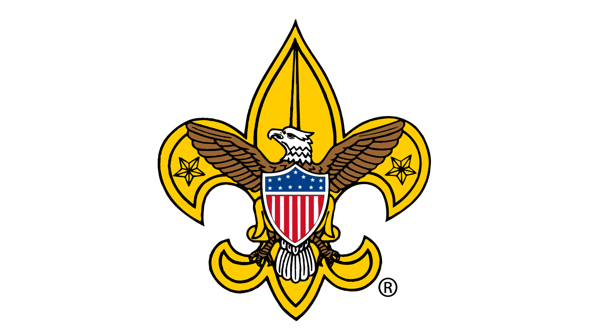

Boy Scouts is a transformative organization that equips young individuals with essential life skills, leadership qualities, and a strong sense of community. Through engaging activities such as outdoor adventures, camping, and service projects, scouts develop resilience, problem-solving abilities, and teamwork. The program emphasizes core values like trustworthiness, loyalty, and kindness, fostering personal growth and character development. Additionally, Boy Scouts provides opportunities for youth to take on leadership roles, manage projects, and give back to their communities, helping them grow into responsible and capable leaders who are prepared to face future challenges. Overall, Boy Scouts is an invaluable experience that shapes well-rounded, confident, and community-minded individuals.

