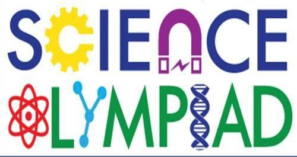

Science Olympiad is a prestigious academic competition that fosters student interest and excellence in science and engineering. Teams of students compete in various events that cover a wide range of scientific disciplines, including biology, chemistry, physics, and engineering. Each event challenges participants to apply their knowledge, critical thinking, and problem-solving skills to real-world problems and experimental tasks. The competition emphasizes hands-on learning, teamwork, and creativity, encouraging students to explore and deepen their understanding of scientific concepts. By participating in Science Olympiad, students gain valuable experience and develop a passion for STEM fields, which can inspire future careers in science, technology, engineering, and mathematics.